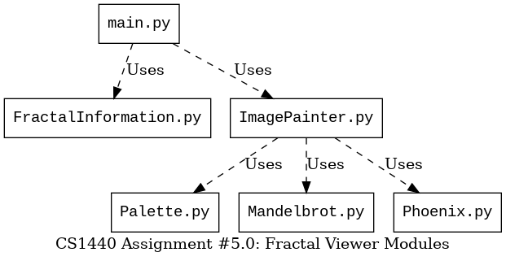
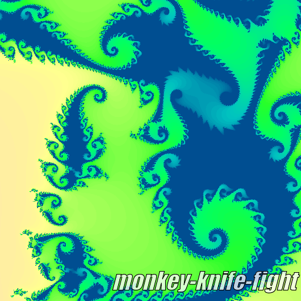
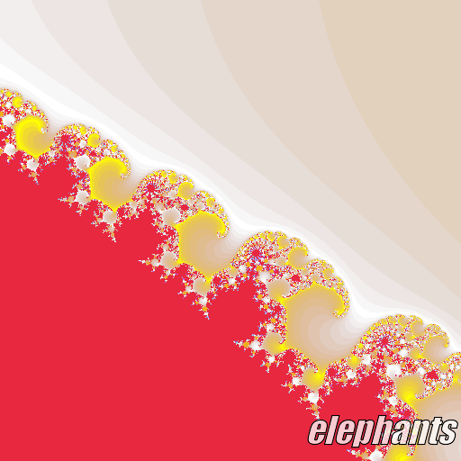
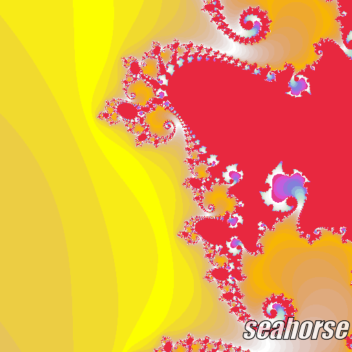
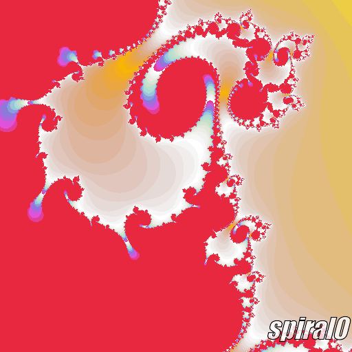
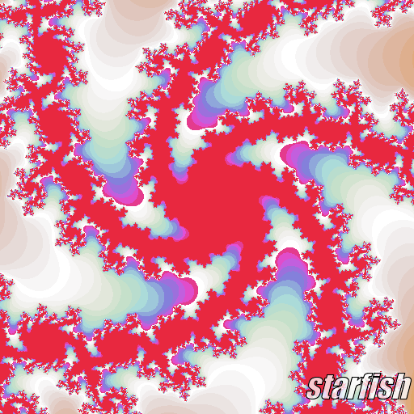

### NOTES TO GRADER: 

I know that the instructions said to delete the whole README file, but I'm submitting this right before midnight on 
Friday, so I don't exactly have a TA to verify to do this. I'm sorry if this is an inconvience/frustration, 
I know you guys are spending a lot of time grading these, so I'll be brief: 

1. I specify in my plan that I will during the next sprint make the appropriate functions private. The professor
said this was fine to do, so please don't doc any points for that. 
2. For the design phase, I may have accidentially saved the first draft of the UML diagram as a .png file rather than
a .pdf file. I've fixed that in this phase, and thankfully the diagram wasn't changed that much from its original 
design. Sorry about that if it's difficult to read from the 2nd phase. 

I think that's it! Thank you for grading


# CS 1440 Assignment 5.0: Refactoring - Instructions

[TOC]


## Description

In this sprint you will refactor this program into a cleaner, more pliant code base while keeping the *original functionality intact*.  Resist the urge to improve this program's functionality or performance.

Pure refactoring is about *preserving* existing functionality, even if that
functionality is incorrect.  In the next sprint (Assignment 5.1) you will
complete this project by enhancing the system with new capabilities.

Read and understand the starter code.  Document some of the code smells that
you find, one of each type.  Then, refactor the code into an equivalent program
that outwardly behaves the same, but is inwardly clean, elegant and easy to
read.

Create helpful documentation and improve the coverage of unit tests.

_This is not a hint for you to go looking for some cleverly-hidden bug; there
are no easter-eggs.  Refactor the starter code under the assumption that it
works correctly._

## Previous Semester Assignment Statistics

Statistic                        | Value
--------------------------------:|:---------------
Average Hours Spent              | 10.25
Average Score % (Grade)          | 76.2% (C)
% students thought this was Easy | 12.0%
... Medium                       | 56.4%
... Hard                         | 24.8%
... Too Hard/Did not complete    | 6.8%


## Following the Software Development Plan

Your grade on this assignment depends upon how well you follow the SDP.  You demonstrate this by following instructions, through your documentation, and by *tagging* commits.

-   You will work on this project for two sprints.
    -   The tags you will use to mark milestones will be named for the sprint.
-   Incorrectly spelled/capitalized tags are ignored.
-   Read the [assignment penalties](./Rubric-5.0.md#penalties) to know what kinds of problems we are on the lookout for.
-   **If you tag the wrong commit**, refer to `Using_Git/Intermediate_Git.md` in the lecture notes for instructions.


**IMPORTANT: We follow this outline when grading.  You should follow it, too!**  If something listed here is not found in your submission, you *will* lose points.

0.  Tag `5.0-analyzed` on the commit at the end of **Phase 1: System Analysis**.  Your work up to this point includes:
    *   Carefully study the [Requirements](#requirements) section below
    *   Read the starter code
    *   `Plan-5.0.md`
        *   Phases 0 and 1 are complete.
        *   Filler text is **erased** once your information is filled in.
    *   `Signature.md` is updated, TODO and filler entries are **erased** and replaced with your activity up to this point.
    *   *Grace Points: if the `5.0-analyzed` tag is pushed by midnight on the Sunday before the due date, you will receive up to 5 points back from other lost points on this assignment*
1.  Tag `5.0-designed` on the commit at the end of **Phase 2: Design**.  Your work up to this point includes:
    *   First draft of `doc/Smells.md`.
        *   By this time you should be able to document some code smells
        *   You are only required to write up 11 code smells - one of each type
        *   Don't worry about finding one example of each type of smell, you will keep finding them up until the end
    *   A first draft of the **User's Manual** describing the existing user interface (UI)
        *   Our client neglected to write this when he first created the program, so it's up to you to do this
    *   Create a new UML Class Diagram as you work on this phase of the Software Development Plan
        *   Save it as a PDF named `doc/UML-5.0.pdf`
        *   At this phase in the project your program doesn't have Classes yet
        *   Just pretend that a Module is a Class (there is a way to draw modules in UML, don't worry about it now)
        *   Do not include Unit Test files
            *   If the word "test" appears in the file's name, leave it off
    *   First draft of unit tests are written 
        *   Practice Test-Driven Development: at this point in the project these tests will not pass because they code they test hasn't yet been written
        *   These tests are a design tool that help you plan what these classes will do
        *   You may need to update these tests as you find and fix problems with your program (or the tests themselves!)
    *   `Plan-5.0.md`
        *   Each sprint gets its own SDP document.
        *   Phase 2 includes **clear and easy to read** descriptions and pseudocode for each function/method that you will write in the program (you are not required to write pseudocode for code provided by the instructor).
        *   Phase 4 includes descriptions of the Unit Tests that were written
        *   Filler text is **erased** once your information is filled in
        *   Do not paste Python code into the Plan
        *   Try not to write executable pseudocode; *if we can paste your pseudocode into the REPL and run it, you're doing it wrong*
    *   `Signature.md` is updated
    *   *Grace Points: if this tag is pushed by end of day the Sunday before the due date, you will receive up to 5 points back from other lost points on this assignment*
2.  Tag `5.0-implemented` on the commit at the end of **Phase 3: Implementation**.  Your work up to this point includes:
    *   Runnable source code under `src/`
    *   `Plan-5.0.md`
        *   Phase 3 **does NOT include copy and pasted code**
        *   Changes from your original plan are noted here, with an explanation of why you changed it
        *   If you did not deviate from your plan, erase the filler text and leave this part blank
    *   `Signature.md` is updated
3.  Tag `5.0-tested` on the commit at the end of **Phase 4: Testing and Debugging**.
    *   *This tag may be on the same commit as `5.0-implemented`*.  Your work up to this point includes:
    *   `Plan-5.0.md`
        *   Phase 4 lists the commands you ran to test your program, with brief descriptions of what a user should expect to see when they run the same commands.
            * Example:
                ```
                Command Ran: <what command did you run in the command line>
                Bug Found: <if a bug was found, what was it? Otherwise note here that it worked as expected>
                Bug Fixed: <if there was a bug, then note here how you fixed it>
                ```
        *   This proves that you tested your program, and lets us replicate your results.
        *   It also tells us what bugs were found and how you fixed them.
        *   Filler text is **erased** once your information is filled in.
    *   `Signature.md` is updated.
4.  Tag `5.0-deployed` on the commit that you want us to grade for this sprint.
    *   This tag lets you continue to work on the next sprint without the grader marking your submission late.
    *   *This tag may be on the same commit as `5.0-tested` and `5.0-implemented`*.  Your work up to this point includes:
    *   `Plan-5.0.md`
        *   Phase 5 may be left blank, there isn't much for you to say.
        *   Phase 6 is filled out, organized and easy-to-read.
        *   Filler text is **erased** once your information is filled in.
    *   `Signature.md` is filled out and **there are no more TODOs/filler entries**.
    *   `doc/Smells.md` contains at least **one** example of each kind of code smell found in the starter code.
    *   `doc/UML-5.0.pdf` matches your final code submission.
    *   **OPTIONAL** If you have special instructions for the grader, *erase the contents of `README.md` in the root directory* and replace it with your instructions.
        *   Do not request your **Grading Gift** in `README.md` or in Git commit messages.
5.  The tags `5.0-analyzed` and `5.0-designed` must be on their own commits; they cannot be together.
    *   The tags `5.0-implemented`, `5.0-tested`, and `5.0-deployed` *may* be on the same commit.
    *   Make sure that each tag has the appropriate file(s) completed/filled out.


## Requirements

*   Begin by cloning and studying the starter code
    *   The starter code is runnable out-of-the-box.  If the code crashes before you have begun changing it, refer to [Tkinter Installation & Troubleshooting](./Tkinter.md) for instructions.
*   After you have studied the code and identified everything that is wrong with it, you will clean it up.  You have a lot of latitude in how you can do this.  All of these things are on the table:
    *   Renaming variables
    *   Deleting unused variables or lines of code
    *   Erasing or rewriting misleading code comments
    *   Changing function parameters
*   Refactor the code into a cleanly-written program which retains the original functionality
    *   Create new modules or classes and migrate existing functionality to the right place
*   Write technical documentation for two key audiences
    *   A **User's Manual** for the non-technical audience of end users
    *   A clear and comprehensive **Software Development Plan** and **UML Class Diagram** for the technical audience of your fellow DuckieCorp programmers
*   Improve coverage of Unit Tests
    *   Remove outdated and pointless tests
    *   Create new tests to increase the coverage to seven (7) tests


### Identify code smells

Catalogue some of the code smells you encounter in `doc/Smells.md`.

0.  There are **11** code smells named in the document.  Find at least **one** instance of each.
1.  For each instance of smelly code, name the file and the general location it was found.
2.  Quote a snippet of the offending source code.
3.  Explain why the passage of code is not very good.
4.  Describe how you will fix it.

[doc/Smells.md](../doc/Smells.md) has a list of the **11** code smells that you will find along with a template that you will fill out.


### Factor out redundancy

You begin this sprint with two overlapping modules containing redundant code.
Identify passages of code that perform essentially the same tasks and rewrite
them so that duplication is eliminated.

Finish this sprint with a modular program that displays both types of fractals
and where each feature occurs once and only once.  But don't take this too far
- if it takes three new lines of code to liberate one duplicated line, you're
doing it wrong.


### Separate code into modules

You begin this sprint with one driver program and two modules.  Finish this
sprint with a carefully organized *modular* program that is run from a single
*driver* script.  Each module encapsulates one aspect of the program and
provides a well-defined interface to the other modules that use it.  This
organization will enable you to easily add new functionality in the next
sprint.

It is good enough for each file to be a collection of functions and variables.
You _may_ use classes in these modules, but it is not a requirement in this
sprint.  Applying the Object-Oriented techniques of Inheritance and
Polymorphism is the goal of the next sprint.

In the end your project should include these six modules _at minimum:_

0.  `main.py`
    *   The driver; this file is the main entry point of the program
    *   Imports necessary modules to display a fractal on-screen and output a PNG image
    *   Deals with the command-line arguments
        *   Issues a usage message when incorrect arguments are given
1.  `FractalInformation.py`
    *   All fractal configuration data in the program is to be located in this module
    *   Define a single dictionary that hold both Mandelbrot and Phoenix configuration data
2.  `Mandelbrot.py`
    *   Contains a function which, when given a coordinate in the complex plane, returns the **iteration count** of the Mandelbrot function for that point
    *   Does not have anything to do with colors or `Palette`
3.  `Phoenix.py`
    *   Contains a function which, when given a coordinate in the complex plane, returns the **iteration count** of the Phoenix function for that point
    *   Does not have anything to do with colors or `Palette`
4.  `Palette.py`
    *   A color palette is an array of colors; colors are simple strings
    *   This file will contain two color palettes
    *   The following statements hold true for a color palette named `P`:
        *   When the Mandelbrot or Phoenix fractal function returns an **iteration count** of a point in the complex plane, the corresponding pixel is painted the color of `P[count]`
        *   Your program should never allow `count >= len(P)`
        *   Remember, neither `Mandelbrot.py` nor `Phoenix.py` should `import Palette`; find another way to share `len(p)` with their functions
5.  `ImagePainter.py`
    *   Creates a `Tk` window and a `PhotoImage` object
    *   The `PhotoImage` object stores the pixels of the image
    *   This module contains code capable of creating a PNG image file
    *   This is the only module which may import `tkinter`
    *   This is the only module which *uses* any code from `tkinter`

**You are allowed to create new modules as you see fit.**

This diagram shows how modules should be related to each other:



*Mind the capitalization of the filenames!  Windows users may get away with
naming these files in lowercase, but your code **will break** when run on Mac
or Linux.*


### Rely on tests to ensure quality

#### Unit tests

The starter code is supplied with six (6) unit tests.  Some of these tests
provided aren't helpful.  Other tests will need to be rewritten as you refactor
the programs.  Use the unit tests as your "canary in the coal mine" warning you
of mistakes.

*   Add two (2) new unit tests to to increase the coverage over the program's functionality.
*   This means your submission must include at least eight (8) unit tests.
*   100% of the included unit tests must pass.
*   Unit tests that exercise useless code **do not count**
    *   Don't create a function that provides no useful functionality to the program just to increase the number of passing tests but .


##### I have no idea what to test!

The purpose of a Unit Test is to alert you when a change to your program unexpectedly causes a problem somewhere else in the program.  Here are some ideas of things you might test:

*   Ensure the color palettes of the expected length
*   Ensure the color palettes contain strings instead of some other type of data
*   Ensure that the dictionary of fractal configuration information contains the expected number of fractals
*   Ensure that each fractal configuration dictionary contains the expected keys, and that the corresponding values are all of the expected types
*   Ensure that your fractal's `count()` functions return *int* instead of other types

All of these may seem like insignificant, trivial tests, but should any one of these tests fail it would cause your program lots of trouble.  Wouldn't you want to be alerted if something changed and any one of these assumptions became false?


#### Integration tests

Integration testing is done by analyzing the image files left behind by the program.

*   Make samples of the output images generated by the starter code *before* you make any changes to it.
    *   As you refactor the fractal algorithms your program should *always* produce identical images.
    *   When an output image differs from before, you will know you have made a mistake.
    *   There are pictures at the bottom of this document
        *   Because I've overlaid the image's title onto these pictures, they are not identical to the program's output
        *   You really need to make your own copies!
*   How can you tell if an image has changed?
    *   You can eyeball it with an image display tool that lets you quickly flip back and forth between two images
    *   You can use the command-line text tool `cmp` to compare two PNG files:
        *   ```
            $ cmp mandelbrot.png before-mandelbrot.png
            mandelbrot.png before-mandelbrot.png differ: byte 99, line 3
            ```
        *   No output is printed when the files are identical 


### Fractal configuration information

The starter programs contain a dictionary holding parameters used by the
drawing routine to render an image of a region of the complex plane.  Each item
of this dictionary has a name which, when given on the command line, results in
that image being displayed.

When a missing or invalid argument is given to either program, the keys of this
dictionary are printed in a usage message instructing the user how to correctly
invoke the program.

Extract the contents of these dictionaries from the starter programs and unite
them in one dictionary in the `FractalInformation.py` module.  To distinguish
Phoenix fractals from Mandelbrot fractals add a new key/value pair to each
dictionary:

```
'type': 'phoenix',
```

or

```
'type': 'mandelbrot',
```

This piece of information will be used by your program to determine whether to
call the Mandelbrot or Phoenix function to choose the color of each pixel.

You may add new fractal configurations to the configuration dictionary.  Do not
remove the configurations present in the starter code as these images are used
when grading your submission.

Next sprint this program will be made to accept the name of a fractal
configuration file from the command-line so that one does not need to hack the
source code each time they want to produce a new image.  The GUI team has
translated the hard-coded fractal configurations into the sample configuration
files you will find in the `data/` directory.  You may disregard these files in
the first sprint of this project.


### Retain the command line interface

When no argument is supplied to `main.py` all of the choices are displayed to
the user:

```
$ python src/main.py
Please provide the name of a fractal as an argument
	phoenix
	peacock
	monkey-knife-fight
	shrimp-cocktail
	elephants
	leaf
	mandelbrot
	mandelbrot-zoomed
	seahorse
	spiral0
	spiral1
	starfish
```

An invalid argument is reported as an error and is followed by the usage message:

```
$ python main.py moustache
ERROR: moustache is not a valid fractal
Please choose one of the following:
	phoenix
	peacock
	monkey-knife-fight
	shrimp-cocktail
	elephants
	leaf
	mandelbrot
	mandelbrot-zoomed
	seahorse
	spiral0
	spiral1
	starfish
```


### Draft a UML class diagram describing your design

You are working alongside another DuckieCorp team who is creating a
user-friendly GUI for our client's program (_not really, just pretend with me
here_). It helps them immensely to understand how your code is organized.
Submit a UML class diagram describing the modules, their relationships, and
the key functions/methods/data members involved.  You don't have to add
classes to your Python files in this sprint, but be aware that they will
required in the next sprint.

For purposes of this diagram, a Python module (a.k.a. a `.py` file) is
equivalent to a class.  You can draw the boxes as 3-part UML classes OR as UML
modules (if your drawing tool supports them).  You will convert these modules
into classes in the next assignment, so you may as well save time and draw them
as UML classes now.  Your UML diagram should use all of the features described
in the [Module 3 Lecture Notes repo](https://gitlab.cs.usu.edu/erik.falor/fa22-cs1440-lecturenotes/-/tree/master/Module3).

#### Creating And Submitting Your UML Diagram

Once you've got a copy of your UML diagram *in a viewable image format,* commit your UML diagram under the `doc/` directory.

Your UML diagram can be created with any drawing software.  Here are two recommendations:

0.  https://diagrams.net *(also known as draw.io)*
    *   **Uncheck the "Transparent Background" option when you export your UML class diagram to a PNG image**
1.  https://lucidchart.com
    *   Provides free accounts to USU students
    *   Sign up with your USU email (can be done with your Office365 credentials) for **premium** access to LucidChart and LucidSpark
    *   Export as a PNG image, **NOT as a PNG with transparent background**


### Write a User's Manual explaining how to use your program

This won't be the final version of the program, and its command-line interface
will change in the next sprint.  However, other non-programmer employees (e.g.
Quality Assurance testers, Client Services, Sales Demo Technicians, Technical
Support) still need to be able to use this draft of the program.  There is a
need for well-written instructions.  Your manual should be brief; between **1 or
2 kilobytes** of plain text is plenty, no larger than 4 kilobytes, please.

Commit your user's manual in your repository as a file named `doc/Manual-5.0.md`.  A final draft of the user's manual will be written next sprint, so give this some thoughtful consideration now.


### Write your Plan in `doc/Plan-5.0.md`

Although you aren't exactly creating a new program this time, planning is just as essential as ever.

*   In **Phase 0: Requirements Specification** and **Phase 1: System Analysis** study the starter code to learn how it works, how data flows through it, and identify junk code.
*   In **Phase 2: Design**, we'll expect to see signatures for the new functions that you will create to replace the smelly ones, as well as your UML class diagram.
*   By the end of **Phase 3: Implementation** the program will behave just like the starter code, while being structured in a much better way.
*   Don't forget to reserve adequate time for **Phase 4: Testing & Debugging** to ensure that you didn't accidentally break any part of the program!


## Program Performance

This program isn't going to win any races.  The equivalent C++ program is literally 10,000x faster than this one, generating a fractal in the blink of an eye.  There just isn't a lot of room for improvement without switching to a different programming language.  Making this program run faster isn't a high priority for you.  It is more important that you arrive at a clean, readable and maintainable solution than a fast one.

An additional complication is that the speed of this program is influenced by external factors that are not easy to change, such as your CPU and your operating system.  As much as I would like you to all switch to Linux, this is not feasible.

Instead, I provide this rough guide to the render times of each fractal so you can know what to expect.  If your computer is on the slow side, you should do most of your testing with the "fast" fractals.  The speed of each fractal in the table is proportional to the render time of `mandelbrot`; numbers less than one are faster than `mandelbrot`.

| Fractal              | Proportion of `mandelbrot`
|----------------------|---------------------------
| `leaf`               | 0.76x
| `phoenix`            | 0.81x
| `mandelbrot`         | 1.00x
| `monkey-knife-fight` | 1.29x
| `mandelbrot-zoomed`  | 1.64x
| `seahorse`           | 1.81x
| `peacock`            | 2.01x
| `shrimp-cocktail`    | 2.19x
| `spiral0`            | 2.41x
| `starfish`           | 2.94x
| `spiral1`            | 3.03x
| `elephants`          | 3.06x


## Output examples

The following are images that the starter code is capable of producing.  As you refactor the program, ensure that your program's output continues to match these samples, down to the size of image and the color scheme.


### Phoenix


### Peacock


### Monkey! Knife! Fight!




### Shrimp Cocktail


### Elephants




### Leaf


### Mandelbrot


### Mandelbrot, Zoomed


### Seahorse




### Spiral #0




### Spiral #1


### Starfish


